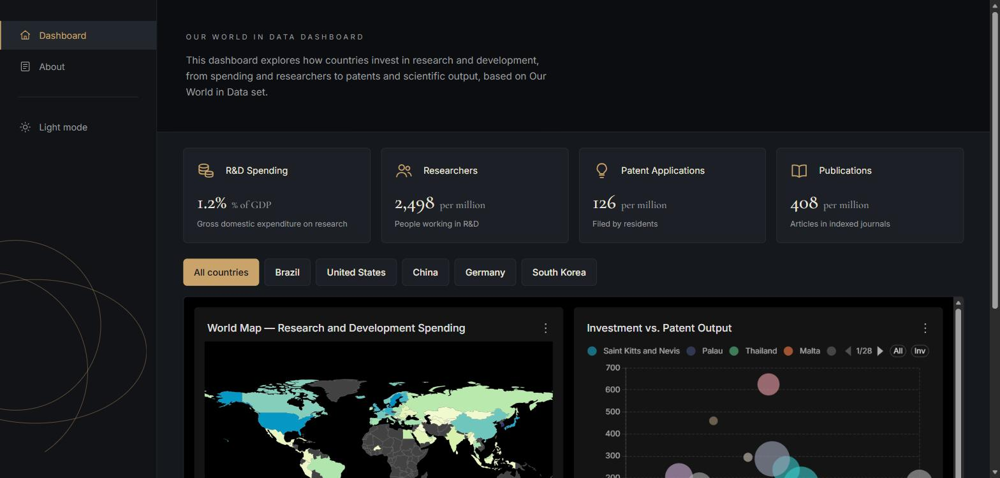
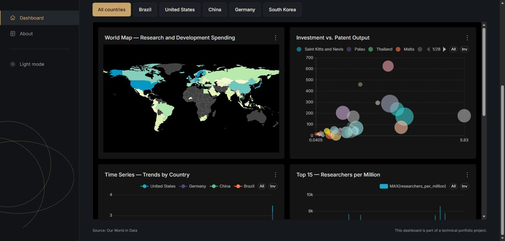
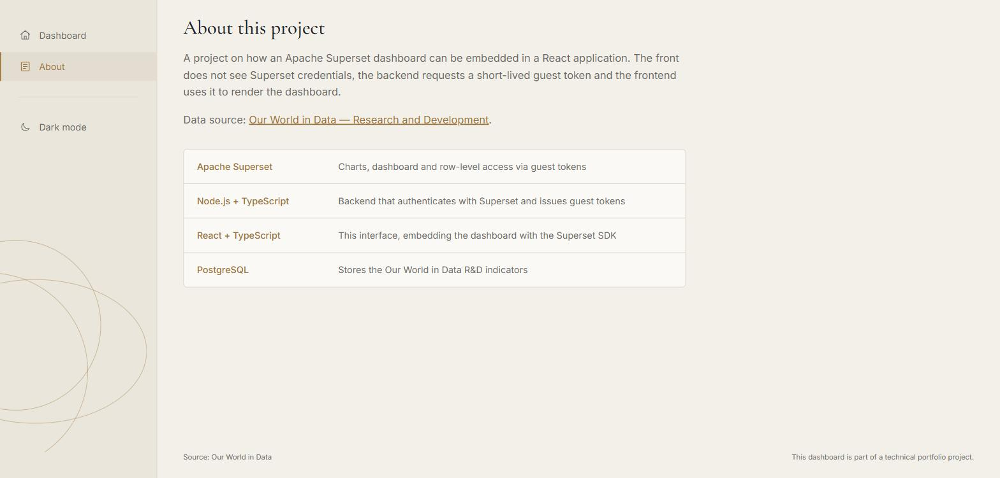
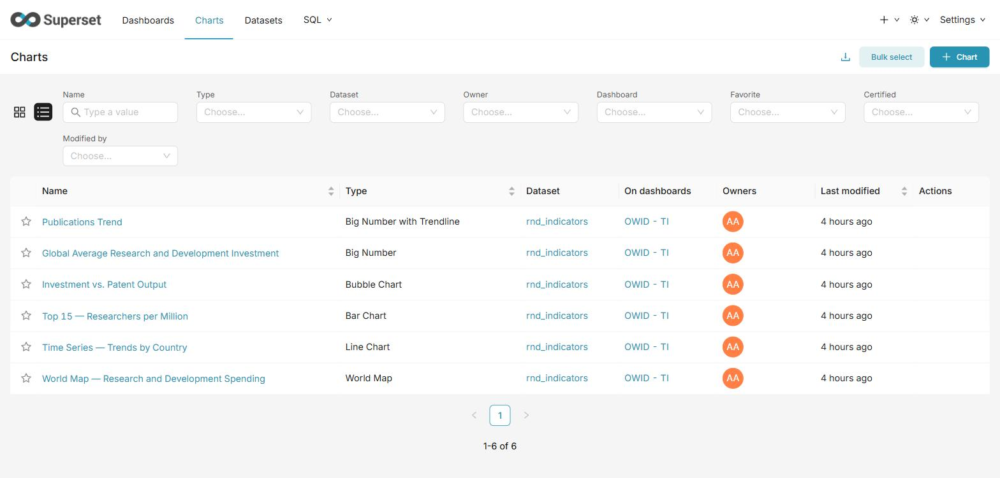
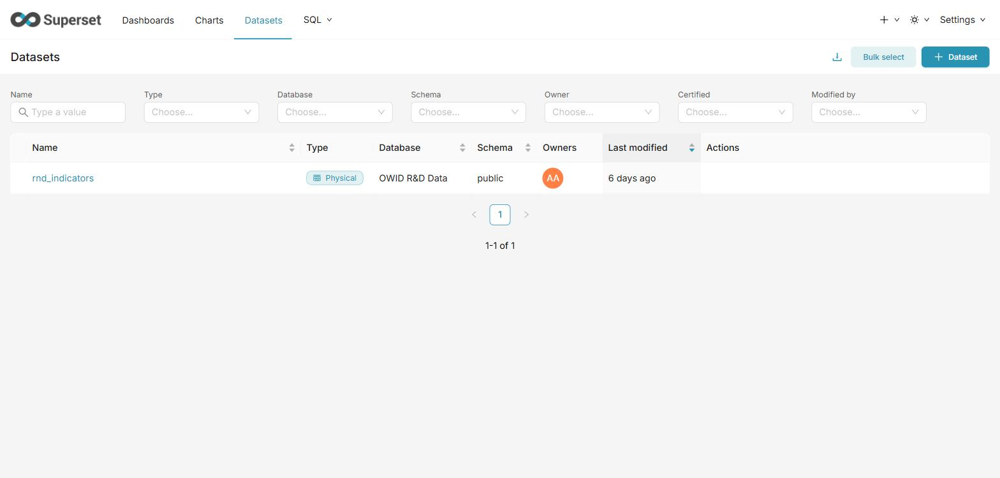
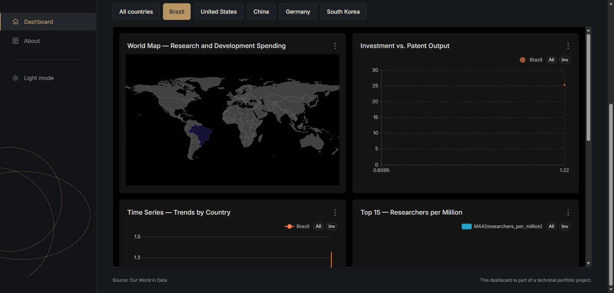
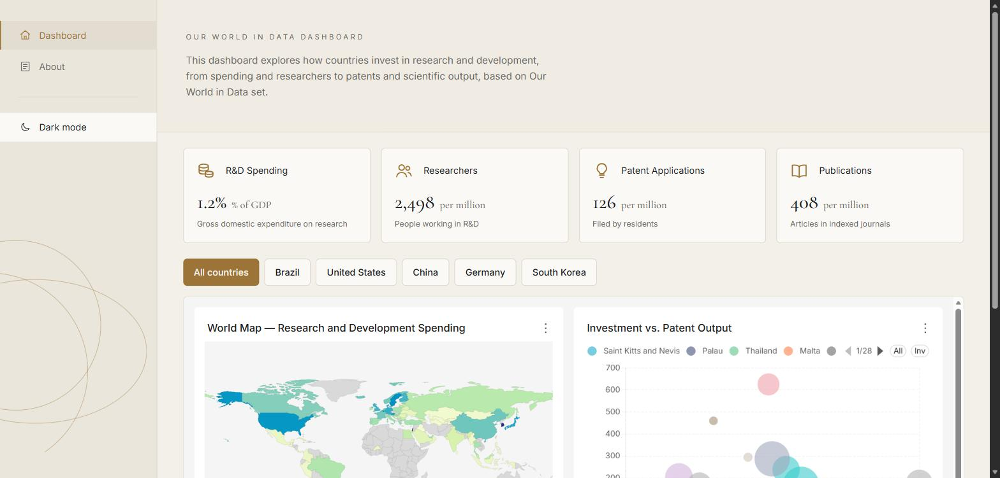
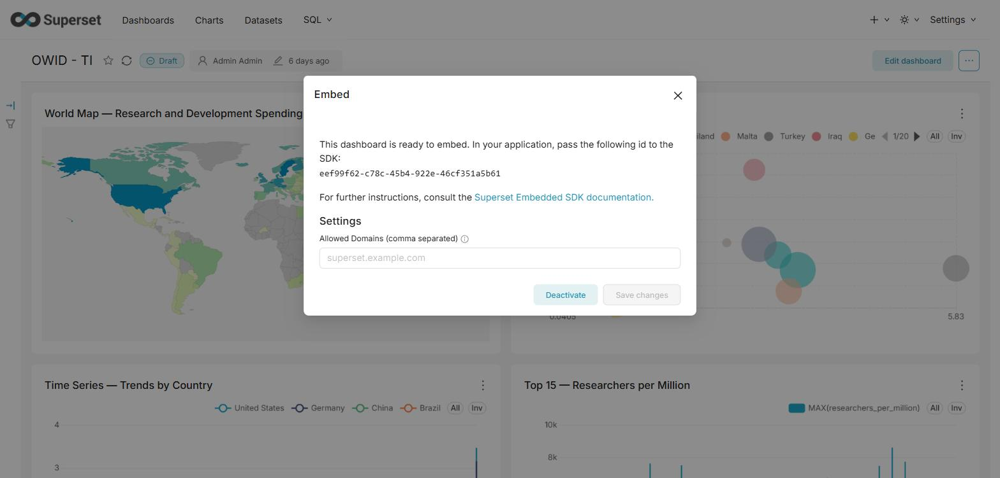

   # Global R&D Indicators — Superset Embedded Dashboard

   Project built as study on how Apache Superset can be embedded inside a React application without ever exposing Superset's own credentials to the browser.

   
   
   

   ```mermaid
   sequenceDiagram
      participant User as Browser (React app)
      participant Backend as Backend (Express)
      participant Superset as Superset

      User->>Backend: POST /api/guest-token { country? }
      Backend->>Superset: POST /api/v1/security/login (admin credentials)
      Superset-->>Backend: access_token
      Backend->>Superset: GET /api/v1/security/csrf_token/
      Superset-->>Backend: csrf token + session cookie
      Backend->>Superset: POST /api/v1/security/guest_token/ (dashboard id, optional RLS clause)
      Superset-->>Backend: guest_token (5 min, scoped)
      Backend-->>User: guest_token
      User->>Superset: embedDashboard() loads the iframe with the guest_token
      Superset-->>User: rendered dashboard, data already filtered by RLS if applicable
   ```

   The admin username and password are kept securely in the backend’s environment variables and never exposed to the browser. The browser only receives a guest token, which is limited to a single dashboard and expires after five minutes. When a country filter is applied, the token also includes a row-level security rule that limits the data the underlying queries are allowed to access.

   ## The three pieces

   ### 1. The dataset (`/superset`)

   The data is four indicators from [Our World in Data's Research & Development topic](https://ourworldindata.org/research-and-development): R&D spending as % of GDP, researchers per million people, resident patent applications per million people, and scientific publications per million people.The choice of the CSVs are because they are clean and easy to merge, which meant I could spend my time on the guest-token flow instead of on data cleaning.

   `superset/seed/seed_owid_data.py` downloads the four CSVs, joins them into a single `rnd_indicators` table, and loads it into a Postgres database (`owid_data`).

   Supersetruns from the `apache/superset` image, with one addition: the base image ships without a Postgres driver, so `superset/Dockerfile` installs `psycopg2-binary` on top of it. 

   The setup of th the actual charts and dashboard in Superset have to be manually. This means connecting the `rnd_indicators` dataset, turning on “Embed dashboard,” and giving the Gamma role read access to the dataset. These steps only need to be done once through the Superset UI. Superset stores this configuration in its own metadata database. 

   So, after a fresh clone, the data and infrastructure are set up automatically, but the dashboard itself still needs to be recreated manually. The steps for doing that are listed in `Running it locally`.

   
   

   ### 2. Backend (`/backend`)

   Small Express + TypeScript application with two routes and two services. `services/supersetAuth.service.ts` handles the log in as admin, fetch a CSRF token, then request the guest token itself.

   The second endpoint, `/api/kpis`, runs a plain SQL average over the same `rnd_indicators` table to feed the four stat cards on the dashboard's home page. It's a direct `pg` connection to Postgress.

   The `supersetAuth.service.test.ts` test file mocks `fetch` and checks the token logic. `app.test.ts` drives the real Express app through `supertest` and checks that failures scenarios.

   ### 3. Frontend (`/frontend`)

   React + Vite + TypeScript + Tailwind. It requests the backend for a guest token, hands it to `@superset-ui/embedded-sdk`, and lets the SDK mount an iframe.

   - The SDK can return an object with methods like `setThemeMode` and `unmount` to switch themes in the embedded dashboard without reloading it.
   - The country filter in frontend layout don't use Superset's own filter UI at all. Picking a country re-fetches a *new* guest token. Superset have it's onw filters, but I wanted to understand better how to pass information between the frontend application and the embeed dashboard.

   
   

   ## Running it locally

   Docker Desktop and Node.js 20+ needed.

   1. **Copy the environment files** and fill in real secrets:
      ```bash
      cp .env.example .env
      cp backend/.env.example backend/.env
      cp frontend/.env.example frontend/.env
      ```

   2. **Start Postgres, Superset, and the backend:**
      ```bash
      docker compose up -d postgres superset backend
      ```

   3. **Load the dataset:**
      ```bash
      docker compose run --rm seed
      ```

   4. **Build the dashboard in Superset** (`http://localhost:8088`, login from your `.env`):
      - Connect a database pointing at the `owid_data` Postgres database
      - Create a dataset on the `rnd_indicators` table
      - Build the six charts and put them on one dashboard — exact configuration in the [chart reference](#chart-reference)
      - Enable "Embed dashboard" on it, allow the origin `http://localhost:5173`, and copy the generated UUID
      - Under Settings → List Roles → Gamma, grant `dataset access on [OWID R&D Data].[rnd_indicators]`

   

   5. **Set the dashboard id** in `backend/.env` (`SUPERSET_DASHBOARD_ID`) and `frontend/.env` (`VITE_SUPERSET_DASHBOARD_ID`), then restart the backend:
      ```bash
      docker compose up -d backend
      ```

   6. **Run the frontend separately:**
      ```bash
      cd frontend
      npm install
      npm run dev
      ```

   7. Open `http://localhost:5173`.

   ## Chart reference

   All six charts read from the `rnd_indicators` dataset. `2020` is used as the reference year across the snapshot charts because it has the best coverage across all four indicators.

   | Chart | Type | Dimensions / axis | Metric(s) | Filters |
   |---|---|---|---|---|
   | World Map — R&D Spending | World Map | Country field: `iso_code` | `MAX(rnd_spending_pct_gdp)` | `year = 2020` |
   | Time Series — Trends by Country | Line Chart | X-axis: `year` · Group by: `country` | `MAX(rnd_spending_pct_gdp)` | `country IN (United States, China, Brazil, Germany, South Korea)` |
   | Top 15 — Researchers per Million | Bar Chart (horizontal) | Dimension: `country` | `MAX(researchers_per_million)` | `year = 2020`, sorted desc, limit 15 |
   | Investment vs. Patent Output | Bubble Chart | Series: `country` · Entity: `iso_code` | X: `MAX(rnd_spending_pct_gdp)` · Y: `MAX(patent_applications_per_million)` · Size: `MAX(scientific_publications_per_million)` | `year = 2020` |
   | Global Average R&D Investment | Big Number Total | Temporal X-axis: `year` (see note) | `AVG(rnd_spending_pct_gdp)` | `year = 2020`, Time Range: No filter |
   | Publications Trend | Big Number with Trendline | Temporal X-axis: `year` | `AVG(scientific_publications_per_million)` | `year >= 2010` |

   - `year` is stored as a plain integer, not a real date column, so Superset won't offer it as a time axis until you mark it explicitly as "temporal" in the dataset editor, under **Columns**, tick "Is temporal" on `year` and set the datetime format to `%Y`.

   ## Next steps

   - Cache the admin access token instead of logging in on every guest-token request, with proper handling for expiry
   - Export the Superset dashboard as a versioned asset bundle so a fresh clone doesn't need the manual UI steps 
   - Add end-to-end tests
   - A specific `Embed` role instead of default Superset `Gamma` role
   - Make the frontend filter react to changes made directly to the Superset filter